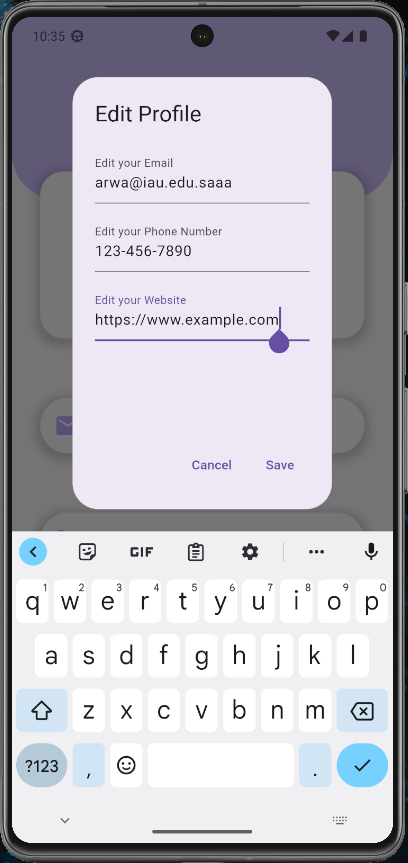

# Profile Page App

This Flutter app allows users to view and edit their profile information, including email, phone number, and website.

## Features

- Display the user's profile information in a clean and stylish layout.
- Edit the user's email, phone number, and website through a convenient dialog.

## Getting Started

1. **Clone the Repository**

    ```bash
    git clone https://github.com/your-username/your-repository.git
    ```

2. **Navigate to the Project Directory**

    ```bash
    cd your-repository
    ```

3. **Install Dependencies**

    ```bash
    flutter pub get
    ```

4. **Run the App**

    ```bash
    flutter run
    ```

## Usage

1. Open the app on your device or emulator.
2. View your profile information.
3. Tap the "Edit Profile" floating action button to open a dialog for updating your email, phone number, and website.
4. Enter the new information in the respective fields and tap "Save" to apply the changes.

## Code Structure

- `lib/main.dart`: The entry point of the application.
- `lib/widgets/ProfileBox.dart`: Widget for displaying the user's profile box.
- `lib/widgets/ProfileInfo.dart`: Widget containing the user's email, phone number, and website.
- `lib/widgets/Email.dart`, `lib/widgets/PhoneNumber.dart`, `lib/widgets/Website.dart`: Widgets for displaying and editing email, phone number, and website, respectively.

## Dependencies

- [flutter](https://flutter.dev/): The Flutter framework.

## Screenshots



